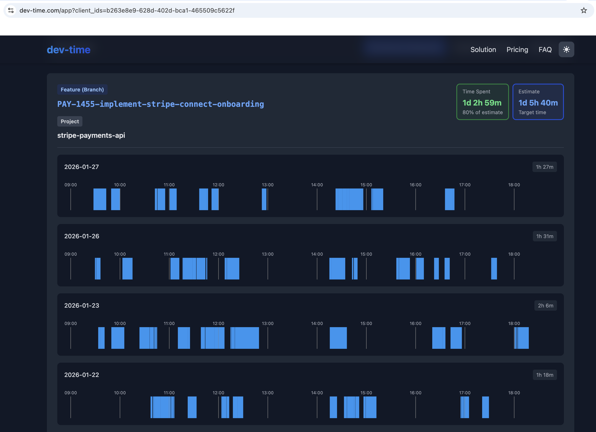

# [dev-time.com](https://dev-time.com/)

**Automatic. Non-Invasive. Developer Time Tracking.**

No more "Start/Stop" buttons. No more end-of-day guessing. Time is automatically tracked per git branch.

**Privacy-first:** no screenshots, no keystrokes, no code content collected.



**[See Live Demo](https://dev-time.com/app?client_id=b263e8e9-628d-402d-bca1-465509c5622f&date_from=2026-01-01&date_to=2026-01-31)**

## How it works

Every 15 seconds, the script checks if you modified any files in the current project. If yes, it sends your project name, git branch, and timestamp. Nothing else. No file names, no code, no keystrokes, no screenshots.

```json
{
  "project_name": "my-saas-app",
  "git_branch": "feature/auth",
  "client_id": "a1b2c3d4-...",
  "created_at": "2026-01-21T14:32:15Z"
}
```

See exactly what's sent: [devtime.sh#L67](https://github.com/dev-time-tracker/timetracker/blob/master/devtime.sh#L67)

## Setup

```bash
# 1. cd to your project directory
cd /path/to/your/project

# 2. Download
curl -O [https://dev-time.com/devtime.sh](https://github.com/dev-time-tracker/timetracker/blob/master/devtime.sh)
chmod +x devtime.sh

# 3. Run
./devtime.sh
```

## View your data

Visit: `https://dev-time.com/app?client_id=YOUR_CLIENT_ID`

Your client ID is stored in `~/.devtime_id` and shown when the script starts.

## Auto-start on login

### macOS (launchd)

To auto-track a specific project on login:

```bash
# 1. cd to your project directory
cd /path/to/your/project

# 2. create launchd background service
d="$PWD"; p=~/Library/LaunchAgents/com.devtime.plist
mkdir -p ~/Library/LaunchAgents
cat > "$p" <<EOF
<?xml version="1.0" encoding="UTF-8"?><plist version="1.0"><dict>
<key>Label</key><string>com.devtime</string>
<key>ProgramArguments</key><array><string>/bin/bash</string><string>$d/devtime.sh</string></array>
<key>WorkingDirectory</key><string>$d</string>
<key>RunAtLoad</key><true/><key>KeepAlive</key><true/>
</dict></plist>
EOF
launchctl unload "$p" 2>/dev/null; launchctl load "$p"
```

### Linux (systemd)

Create a systemd user service:

```bash
# 1. cd to your project directory
cd /path/to/your/project

# 2. create systemd background service
d="$PWD"
mkdir -p ~/.config/systemd/user
cat > ~/.config/systemd/user/devtime.service <<EOF
[Service]
WorkingDirectory=$d
ExecStart=/bin/bash $d/devtime.sh
Restart=always
[Install]
WantedBy=default.target
EOF
systemctl --user daemon-reload && systemctl --user enable --now devtime.service
```

## Privacy

- ✅ Tracks: project name, git branch, timestamp
- ❌ Never collects: file names, code content, keystrokes, screenshots
- ✅ Open source: inspect the [67-line script](https://github.com/dev-time-tracker/timetracker/blob/master/devtime.sh)
- ✅ Your data: export as CSV from the dashboard

